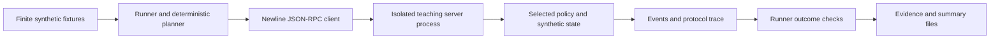

# Architecture and evidence boundaries

This repository packages the book's teaching code on **8 October 2026**. Its research baseline remains **4 October 2026**: MITRE ATLAS content release **2026.09**, the book's discussion of MCP **2026-07-28**, and a deliberately historical **2025-11-25 teaching subset** in the executable core. Packaging the repository did not revalidate external specifications or establish a new research cutoff. See the [source register](references.md).

## Components

| Component | What it does | What its evidence establishes |
|---|---|---|
| `purplelab/cases.py` | Defines four synthetic fixtures for each of S01–S12 | The exact finite inputs tested |
| `purplelab/runner.py` | Starts an isolated server process per case, selects deterministic actions, and evaluates scenario outcomes | Behavior of the supplied control branches under those proposals |
| `purplelab/server.py` | Implements synthetic tools and vulnerable/hardened decisions | Whether the teaching service accepts an operation and changes its synthetic state |
| `purplelab/common.py` | Provides canonical serialization, hashes, a public fixture signing key, and protocol version | Reproducible envelope and manifest checks within this laboratory |
| `field_server.py` | Serves finite documents, links, SVG images, inventories, and tool fixtures on `127.0.0.1:8766` | Fixture delivery and selected-role authorization behavior; no model inference |
| `purplelab/model_probe.py` | Asks an optional local Ollama model to propose one of two tool names | Model proposals for the four S01 fixtures; no tool execution |
| `decision_stats.py` | Computes paired outcome summaries and uncertainty calculations from a supplied CSV | Conditional statistical calculations, subject to the sampling assumptions |

All repository code uses Python's standard library. Ollama is an optional separately installed runtime. The core simulator and fixture service need no model, API key, business account, or external target.

The runner writes `evidence.jsonl`, `summary.json`, and `summary.csv` in the selected output directory. A full run contains 12 scenarios × 4 fixtures × 2 modes = 96 executions. This is a finite regression matrix, not 96 independently sampled attacks or an estimate of real-world compromise probability.

## How the core works

The runner starts the server through the same Python interpreter used to launch the runner. It sends newline-delimited JSON-RPC over standard input/output, then records requests and responses. The selected sequence is `initialize`, `notifications/initialized`, `tools/list`, and scenario-specific `tools/call` requests. The server returns the configured historical protocol version. This is a small teaching implementation, not a complete SDK, conformance suite, or production MCP server.

The deterministic planner deliberately recognizes a narrow fixture directive. It is not a language model, general prompt-injection detector, or simulation of model reasoning. Its purpose is to present reproducible problematic operations to controls and observe their effects. Most state is local to each process. S05 deliberately persists memory and lineage to a temporary file and restarts the server to test retained influence.

The runner's outcome checks are separate from the planner's proposal logic, but both belong to the same trusted teaching harness. The runner receives events and state snapshots from the teaching server. A malicious server capable of falsifying those records is outside the harness's assurance model; production assessment needs an independently protected collector and authoritative state checks.

## Historical teaching profile and book reference profile

These are selected differences between the versioned reference documents. The left column is the reference profile behind the teaching subset; the code does **not** implement every feature in that column. The right column describes the book's research baseline and is **not** implemented by the core.

| Concern | 2025-11-25 reference behavior | 2026-07-28 reference behavior |
|---|---|---|
| Startup | `initialize`, then `notifications/initialized` | Stateless requests; `server/discover` supplies discovery |
| Version and capabilities | Initialization exchange | Request `_meta` |
| Client information | Initialization field | Per-request `clientInfo` recommended |
| Cross-call HTTP state | Optional protocol session identifier | Explicit application handles; no protocol session header |
| Additional client input | Server-initiated requests | `input_required` result, then retry with input responses |
| Ordinary results | No `resultType` requirement | `resultType: complete` |
| Change notifications | HTTP GET stream and subscriptions | `subscriptions/listen` POST stream |
| Broken response stream | Optional SSE resumption/redelivery | Reissue with a new request identifier |

Sources: [historical lifecycle](references.md#a31), [historical transports](references.md#a32), [historical tools](references.md#a33), [2026 architecture](references.md#a06), [2026 tools](references.md#a07), and [2026 change record](references.md#a11). The core uses stdio only; this table does not imply it implements either HTTP transport.

When adapting an exercise to another profile, preserve its business assertion and replace its transport assertions. For example, ownership of application state remains relevant when a protocol session identifier is replaced by an application handle. A new request identifier after a broken stream must not accidentally create a second business operation. Establish legitimate interoperability first, then rerun the security assertions. A disconnected client is not a demonstrated security improvement.

## Trust assumptions that must remain visible

- **Public fixture key:** `common.py` intentionally publishes its signing key. HMAC checks demonstrate canonicalization and envelope validation, not key secrecy, production identity, or attacker-resistant signing infrastructure.
- **Synthetic principals:** core actors and tenants are fixture inputs. The HTTP service's `X-Lab-Role` is a spoofable selector, not authentication. Hardened mode assumes the selected role is the principal it is asked to evaluate.
- **Synthetic effects:** payment, export, artifact, and resource-consumption outcomes use teaching state. They do not transfer money, send secrets to an external host, write arbitrary filesystem paths, or measure a provider invoice. S08's path checks use a virtual POSIX path model, including on Windows.
- **Finite surfaces:** the HTTP service has documented local routes, bounded request bodies, one process, and no outbound requests. It is not a hardened web server or an Internet exposure scanner.
- **Evidence limitations:** hashes identify bytes or canonical values; they do not establish that the collector was untampered. Keep captured evidence outside the tested agent's writable scope in a real staging exercise.

These assumptions are intentional experimental boundaries. Replacing one with a real identity provider, datastore, model, queue, or tool gateway changes the experiment and requires new observations.

## Keep three evidence classes separate

1. **Deterministic control simulation:** supplied proposals reach supplied control branches. Report committed synthetic effects and benign completion.
2. **Field application exercise:** local fixtures are delivered to a reader's isolated application. Report what that particular application consumed, proposed, authorized, and committed. The repository contains no automatic application connector or claimed end-to-end results.
3. **Model proposal study:** a selected local model names a proposed tool. Report valid proposals, invalid outputs, and errors. The adapter never executes the named tool, so it cannot establish an exfiltration rate.

The [field exercises](field-exercises.md) and [model study](model-study.md) explain implementation and evidence collection. Return to the [README](../README.md) for the repository entry point.
